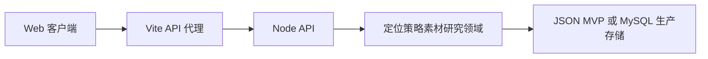

# 系统架构

## 概述

定位派是面向个人 IP 创作者的内容研究与创作工作台。用户通过定位发现访谈明确长期目标，再用分层内容策略组织素材、热点、选题和多平台草稿。

当前 MVP 由 React/Vite Web 客户端和 Node.js HTTP API 组成。API 统一保存定位、策略、素材、研究、选题、草稿、档案审核和拍摄清单数据，并通过来源引用保持内容可追溯。

## 技术栈

- TypeScript、React、Vite
- Node.js 原生 HTTP 服务
- Lucide React 图标
- 本地 JSON 持久化（MVP 默认模式）
- MySQL 连接池与初始化迁移入口（生产准备）
- Node.js `crypto` AES-256-GCM 账号级 API 配置加密
- Vite `/api` 开发代理

## 项目结构

```text
src/main.tsx       React 工作台、定位访谈和策略交互
src/styles.css     主题令牌与响应式样式
src/shared/types.ts共享领域类型
server/index.mjs   API 路由、校验和持久化
vite.config.ts     Vite 配置与 API 代理
```

## 请求流



## 数据原则

- 每个内容资产包含策略层级、目标关联和来源引用。
- 素材使用 checksum 去重。
- 素材撤回采用 `deleted_at` 软删除，默认资源查询和来源选择会排除已撤回素材。
- 策略更新保存版本历史。
- `server/data.json` 是本地 MVP 存储，生产环境使用项目专用 MySQL 数据库。
- `server/mysql.mjs` 读取 `PROJECT_DB_*` 配置，提供连接池、连接验证和 `app_state` 初始化迁移。
- 配置完整的 `PROJECT_DB_*` 后，API 启动从 MySQL 加载状态并将写入回写到集合表和用户文档表；缺少数据库配置时使用 JSON MVP 回退。
- API 1、API 2、API 3 配置按账号写入 `api_settings` 用户文档；Key 使用 `API_CONFIG_ENCRYPTION_KEY` 进行 AES-256-GCM 加密，接口只返回掩码。
- API 1/2 构成主备文本调用链；视觉调用只接受 API 3 配置，不回退到文本模型。
- 私有文件存储默认位于 `server/private-files/`，按账号哈希、UTC 日期和 SHA-256 校验值组织；元数据进入 `private_files` 集合，文件内容不进入 JSON 状态文件。
- Windows Electron 桌面壳由 `desktop/main.mjs` 创建，渲染进程通过沙箱化 `preload.mjs` 使用 IPC；会话由 Electron `safeStorage` 加密保存，窗口关闭默认隐藏到托盘。
- `desktop/sync-client.mjs` 负责多目录配置、文件稳定监听、相对路径事件合并和持久化队列；文件通过 Base64 保持二进制完整性后提交同步 API。
- `server/document-parser.mjs` 为 TXT、Markdown、Word、PDF、Excel 提供独立适配器；同步任务按等待、处理中、成功/失败状态推进，失败仅隔离当前文件，可单独重试。
- 热点研究通过显式收录接口创建 `hotspot` 素材，素材的 `source_type/source_id/source_refs` 指向研究记录，重复收录按账号和研究来源幂等处理。
- 内容能力目录位于 `server/content-capabilities.mjs`，当前登记选题、创作、检查和复盘能力；任务上下文由 `server/content-context.mjs` 按 `owner_id` 和显式资源 ID 组装，不读取 `api_configs`，并递归移除敏感字段。
- 选题评估由 `server/topic-evaluation.mjs` 使用确定性七维规则完成；接口只写回当前账号选题的评估、决策、证据和建议，不调用模型、不虚构缺失热度。
- 草稿流程字段由 `server/draft-workflow.mjs` 提供兼容性默认值；Hook 候选生成和校验是确定性的，四个平台草稿通过 `variant_group_id` 关联但各自独立保存，Hook 和所有输入来源继续保留在 `source_refs`。
- 草稿三道质量检查由 `server/draft-checks.mjs` 提供纯函数：人设检查只提醒，质量门和发布清单可阻断；检查结果绑定草稿版本，修改后清空下游结果并允许重试。
- 人工确认规则集中在 `server/draft-approval.mjs`；专用确认接口在一次持久化中保存当前版本检查快照、确认人和时间，并按 `owner_id + draft_id` 幂等创建或复用拍摄项。撤回保留确认历史，将拍摄项同步为 `needs_revision`；Task 5 新拍摄项在进入拍摄或发布状态时继续校验关联草稿确认。
- 第一阶段质量门由 `server/stage-quality-gate.test.mjs`、MySQL 往返测试和跨平台 E2E 共同覆盖：旧 JSON 安全归一化、嵌套字段持久化、账号隔离、完整 `source_refs`、敏感配置过滤、状态保护与旧拍摄记录兼容。审计不增加运行时模块或依赖。
