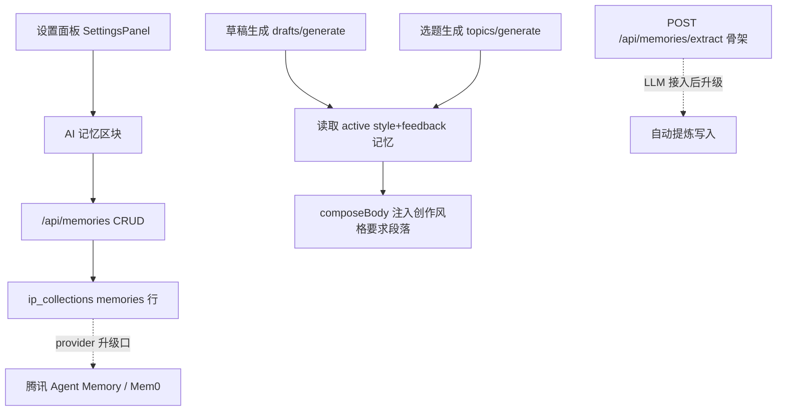

# AI 记忆层

Feature Name: ai-memory-layer
Updated: 2026-08-30

## Description

以内建记忆集合实现创作者偏好/经验的持久化、可视化管理与生成注入，全部记忆白盒存储于既有 ip_collections 体系；通过 provider 字段与 extract 骨架路由预留向腾讯 TencentDB Agent Memory、Mem0 的升级路径。

## Architecture



## Components and Interfaces

### server/index.mjs

1. **memories CRUD**
   - `GET /api/memories`：返回当前用户全部记忆，支持 `?type=style|topic|feedback` 筛选，按 created_at 倒序。
   - `POST /api/memories`：校验 `memory_type` ∈ {style, topic, feedback}、content 非空；同 type 同 content 的 active 记忆存在时返回 200 `{ duplicate: true }`；新建字段：`{ id, memory_type, content, source: 'manual', provider: 'builtin', status: 'active', created_at, updated_at }`；持久化 `saveState('memories')`。
   - `PUT /api/memories/:id`：接受 `{ content?, status? }`，status ∈ {active, archived}，更新 updated_at。
   - `DELETE /api/memories/:id`：物理移除该行（记忆非业务资产，删除即清除）。
2. **memories/extract 骨架**
   - `POST /api/memories/extract`：本期固定返回 422 `{ error: '自动提炼需要先配置大模型', reason: 'llm_not_configured' }`；路由存在以保证前端可探测，LLM 接入选题/草稿链路时替换实现。
3. **注入实现**
   - `activeMemories(userId)` 辅助函数：`state.memories.filter(m => m.owner_id === userId && m.status === 'active')`。
   - drafts/generate：composeBody 中在金句/经历块之后追加段落——`创作风格要求：\n- {content}`（style 与 feedback 记忆逐条列出，无记忆时不出现该段）。
   - topics/generate：`generation_context.memory_count` 记录 active 记忆数。

### src/main.tsx

1. **类型**：`type MemoryItem = { id: number; memory_type: 'style' | 'topic' | 'feedback'; content: string; source: string; provider: string; status: string; created_at: string }`；类型中文映射 `memoryTypeLabels`。
2. **MemoryPanel 组件**（渲染于 SettingsPanel 内"API 中心"之后）：
   - 挂载时 `GET /api/memories`。
   - 类型 chips 筛选（全部/风格/选题/反馈）；添加表单（类型 select + 文本输入 + 保存）。
   - 列表：内容 + 类型 tag + manual/auto 来源 + 日期 + 删除按钮（confirm 后 DELETE）。
   - 自动提炼按钮：点击调 extract 路由，收到 `llm_not_configured` 时展示提示"配置大模型后可用"。
3. **SettingsPanel** 插入 `<MemoryPanel />`，样式沿用面板区块风格。

### src/styles.css

- `.memory-item`（行卡：内容 + 元信息 + 删除）、`.memory-type-tag`（三色，复用 kind-tag 配色逻辑）、`.memory-form`（行内表单）。四主题变量兼容。

## Data Models

```ts
type MemoryItem = {
  id: number
  memory_type: 'style' | 'topic' | 'feedback'
  content: string
  source: 'manual' | 'auto'
  provider: 'builtin' | 'tencentdb' | 'mem0'
  status: 'active' | 'archived'
  created_at: string
  updated_at: string
}
```

存储于 ip_collections `memories` 行（mysql.mjs collectionNames 增加 'memories'），无迁移：空集合自动生效。

## Correctness Properties

1. 归档记忆不参与注入；删除记忆后生成上下文立即不再包含。
2. drafts/generate 的 source_refs 与 generation_context 行为与本期改动前兼容（无记忆时输出与旧版一致）。
3. 记忆 CRUD 仅作用于当前用户（owner_id 隔离）。

## Error Handling

- 非法 memory_type / 空 content → 422。
- 重复记忆 → 200 duplicate:true（前端就地提示"已存在"）。
- extract 未配 LLM → 422 reason: llm_not_configured，前端展示可读提示。

## Test Strategy

- server/memories.test.mjs：
  1. POST 创建/重复拒绝/非法类型 422
  2. GET 列表与 type 筛选、PUT 归档后注入排除
  3. drafts/generate 正文含"创作风格要求"与记忆内容；删除记忆后生成正文不含
  4. extract 返回 422 llm_not_configured
- server/web-assets.test.mjs：面板特征断言（MemoryPanel、memoryTypeLabels、/api/memories、创作风格要求）。

## References

[^1]: server/index.mjs:720 - drafts/generate 组装点
[^2]: src/main.tsx - SettingsPanel 组件
[^3]: .monkeycode/specs/ai-memory-layer/requirements.md - 需求文档
[^4]: https://github.com/TencentCloud/TencentDB-Agent-Memory - 升级候选：腾讯 Agent Memory
