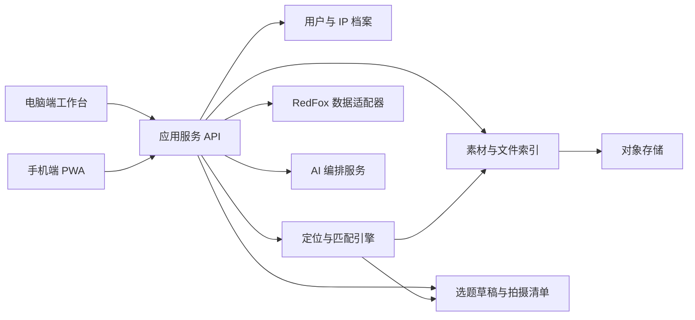

# 定位派｜个人 IP 内容成长平台

Feature Name: content-ip-workbench  
Updated: 2026-08-29

## Description

定位派的品牌主张是“找到你在互联网上的独特价值，持续放大你的影响力”。这是一个面向所有个人 IP 创作者的多端内容研究与创作工作台。核心主链路为：定义创作者定位、生成匹配关键词和主题、按定位收集素材与爆款、拆解内容结构、生成选题、产出多平台草稿、加入当天拍摄清单、手机端进入提词器。商业创业作为首版示例垂直领域，系统模型保持对手艺人、顾问、教练、教师和其他创作者定位的通用性。RedFox 数据由后端统一接入，前端仅访问本系统 API。首版采用桌面同步客户端监测本地素材目录，腾讯云服务器部署后置。

## Architecture



应用服务负责鉴权、数据模型、文件元数据、版本和同步；定位与匹配引擎负责从创作者定位和 IP 核心目标生成关键词、主题和筛选规则，并为所有内容资产提供匹配解释；RedFox 适配器负责热点、爆款、账号和作品数据；AI 编排服务负责筛选、拆解、选题和多平台创作；PWA 负责移动端安装入口与提词器体验。

## Components and Interfaces

### UI Design Direction

首版提供三套可切换的完整视觉主题，主题切换通过 design tokens 驱动，覆盖页面背景、文字、边框、按钮、状态、卡片、编辑器和提词器。主题切换不改变信息架构和业务流程，保证用户可以按个人审美、品牌定位或使用场景选择工作环境。

主题 A “编辑部”：暖白纸张色、墨黑文字、低饱和松石绿，强调内容证据、排版层级和研究密度，适合作为默认工作台。

主题 B “清爽数据”：雾蓝、白色和松石绿，强调数据对比、实时趋势和行动按钮，适合热点研究与高频运营。

主题 C “暖杏创作”：杏仁纸张、深棕和柔和珊瑚色，强调沉浸式写作、镜头准备和手机提词，适合长时间创作与拍摄。

视觉原则：

- 以排版层级、留白和内容卡片建立质感，保持稳定的圆角和阴影语言。
- 以真实封面、头像和来源截图增强内容研究的可信度。
- 使用 Lucide 或 Phosphor SVG 图标，图标承担导航和状态表达。
- 研究卡片、选题卡片和拍摄卡片共享同一信息骨架，减少学习成本。
- 提词器使用高对比度黑底和暖白字，提供大触控区域和低干扰控制栏。
- 所有状态标签同时提供文字和图标语义，支持键盘焦点、窄屏换行和减少动态效果设置。
- 主题选择器展示三套主题的名称、色板、适用场景和小型界面预览；用户选择后写入本地偏好并同步到用户配置。
- 默认入口直接展示工作台首页，左侧导航承载定位发现、研究、素材、结构库、选题、创作和拍摄等核心功能；定位发现作为可重复进入的工作区功能，不再强制作为首次进入流程。
- 每套主题至少定义 `surface`、`text`、`accent`、`positive`、`warning`、`danger`、`border`、`radius`、`shadow` 和 `motion` 令牌，支持未来增加品牌主题。

参考项目与借鉴边界：

| 项目 | 适合借鉴 | 适合本项目的落地方式 |
| --- | --- | --- |
| `nexu-io/open-design` | 设计方向选择、设计系统、实时预览、多端原型工作流 | 用于建立本项目的视觉方向确认流程和 `DESIGN.md` 设计契约 |
| `alchaincyf/huashu-design` | 三方向初稿、反 AI 套路清单、HTML 高保真原型、专家评审 | 用于首轮 UI 方案评审和视觉验收，不直接依赖其生产级运行时 |
| `nextlevelbuilder/ui-ux-pro-max-skill` | 行业化色板、字体组合、响应式和可访问性规则 | 用于设计 token、字体配对和交互验收清单 |
| `shadcn-ui/ui` | 可访问组件、可复制源码、表单/弹窗/表格基础 | 作为 React 组件实现基础，组件样式统一改写为本项目 tokens |
| `ibelick/motion-primitives` | 轻量过渡、列表进入、布局切换动画 | 仅用于研究结果刷新、卡片排序和提词状态切换等关键反馈 |
| `saadeghi/daisyui` | Tailwind 主题变量和快速原型能力 | 作为备选参考，首版优先使用自有组件以保持视觉辨识度 |

推荐实现组合为 React、Tailwind CSS、shadcn/ui 源码组件和自定义 design tokens。OpenDesign 与 Huashu Design 作为设计研究和评审参考，不作为线上应用的运行依赖。

### Positioning Discovery Interview

定位发现是用户进入素材库前的必经引导，可在 5 至 8 轮完成。默认使用 8 个环节，其中最后一个“IP 核心目标”环节包含变现目标与获客目标/其他目的两个字段；IP 核心目标属于整个 IP 档案，后续热点、素材、选题、文案和拍摄内容均使用目标关联进行筛选和解释。系统根据回答质量提前结束或追加追问。每轮只问一个主问题，问题下方提供 2 至 3 个具体例子和“暂时想不到”入口；每轮回答后展示“已确认事实 / 当前推断 / 还需验证”三栏，避免 AI 将猜测伪装成结论。

问题顺序：

1. 经历：过去做过哪些长期、反复或关键的事情？要求用户描述场景、时间和具体动作。
2. 能力：哪些事情用户可以独立完成，或比身边多数人更容易完成？要求举出作品、过程或结果。
3. 需求：哪些人会反复向用户求助？他们在什么场景下遇到什么具体问题？
4. 价值：用户能帮助目标人群完成什么可观察的改变？将抽象能力改写为具体结果或行动。
5. 差异：用户有哪些独特经历、方法、视角、审美、资源或限制，形成了与同行不同的表达角度？
6. 证据与边界：哪些案例、作品、评价或数据可以证明价值；哪些主题、承诺和表达方式不愿意涉及？
7. 表达与持续性：用户愿意长期谈什么、用什么形式表达、在哪些平台出现，以及什么内容可以持续积累。
8. IP 核心目标：用户希望通过整个个人 IP 采用什么方式变现，以及希望通过 IP 获客或实现哪些其他核心目的。

定位候选采用评分模型：`匹配度 = 真实优势 30% + 目标需求 25% + 证据强度 20% + 差异化 15% + 可持续表达 10%`。分数用于排序和解释，不替用户做最终选择。候选输出必须包含定位句、目标人群、核心问题、价值承诺、信任证据、IP 核心目标、3 至 5 个内容支柱、关键词组、素材收集规则、排除规则和待验证问题。每个候选的内容支柱和研究规则必须说明其服务的 IP 核心目标。

### Layered Content Strategy

IP 核心目标定义长期方向，内容策略定义当前内容承担的任务。系统将内容分为三层，并允许同一条内容同时关联一个 IP 核心目标和一个策略层级：

| 策略层级 | 核心任务 | 内容特征 | 推荐场景 |
| --- | --- | --- | --- |
| 泛流量触达 | 获得陌生用户注意和初次互动 | 借助广泛兴趣、公共话题、反差、故事或高共鸣问题进入流量池 | 初期流量积累、账号冷启动 |
| 垂直信任 | 让目标人群确认专业价值和真实经验 | 具体方法、案例、过程、观点和证据 | 关注转化、信任建立 |
| 核心目标转化 | 推动变现、获客或其他 IP 目标 | 产品/服务解释、行动建议、案例结果、合作入口和明确 CTA | 线索、成交、合作、品牌机会 |

系统可以使用 `50% 泛流量触达 + 30% 垂直信任 + 20% 核心目标转化` 作为冷启动建议值。该比例属于可调整的策略参数，用户可以直接编辑，也可以在定期复盘或策略对话后确认新的比例。系统根据用户阶段、平台反馈和目标优先级提出调整建议，并展示调整理由。泛流量内容需要保留至少一个与定位、信任或 IP 核心目标的承接点，承接点可以是观点、案例、系列入口、评论区问题或下一条内容。

策略复盘按照用户设置的周期触发，默认提供每两周一次的复盘建议。复盘内容包括三类策略的发布数量、曝光、互动、关注、线索、成交或其他用户目标指标，并将表现变化与策略比例关联。复盘结论由用户确认后生成新策略版本，保留调整前后的配置和原因。策略对话可以修改比例、阶段、平台重点和内容任务，系统需要将用户确认的结论写入策略版本。

内容生成流程为：先确定内容策略层级，再选择热点和素材，随后生成选题与平台草稿，最后检查内容是否完成该层级任务并连接 IP 核心目标。系统为每条内容记录 `strategy_layer`、`content_job`、`goal_refs[]`、`funnel_parent_id` 和 `funnel_child_ids[]`。

定位发现提示词模板：

```text
你是“定位派”的定位发现教练。你的任务是通过 5 至 8 轮一问一答，帮助用户发现适合长期经营的个人 IP 方向，并明确个人 IP 的核心目标。

工作规则：
1. 每轮只问一个主问题，问题必须基于用户上一轮回答继续追问。
2. 优先追问真实经历、具体动作、服务对象、实际结果、可验证证据和创作目标。
3. 将每轮信息分为“已确认事实、当前推断、待验证问题”，禁止把推断写成事实。
4. 用户回答抽象时，要求补充一个具体场景、人物、作品、数字或前后变化。
5. 用户无法回答时，提供三个具体示例和一个跳过入口。
6. 不提前给出定位结论，不使用“赋能、闭环、全能、专业、热爱”等无法单独验证的词作为核心差异。
7. 信息充分后停止提问，生成 3 个差异化定位候选供用户比较。
8. 在创作目标环节分别记录变现方式和获客目标或其他目的，并说明目标如何影响受众、内容支柱和平台选择。

每轮输出格式：
【本轮问题】一句话
【为什么问】说明该问题将识别哪个定位要素
【回答示例】三个不同职业或生活场景的具体示例
【阶段记录】已确认事实 / 当前推断 / 待验证问题

最终输出格式：
【定位候选 A/B/C】定位句、目标人群、核心问题、独特价值、信任证据、创作目标、内容支柱、关键词组、素材收集规则、排除规则、风险和待验证问题。
【比较表】真实优势、需求强度、证据强度、差异化、持续表达能力，分别给出 1-5 分和评分理由。
【下一步】只询问用户选择、修改或继续访谈，不自动保存未经确认的定位。
```

### Web Client

- 响应式布局适配桌面和手机宽度。
- PWA manifest、service worker 和离线缓存支持手机桌面安装。
- 桌面端提供研究、素材、结构库、选题和创作工作区。
- 移动端优先提供今日拍摄、草稿查看、剪贴板复制和提词器。

### Desktop Sync Client

- 用户选择一个或多个本地素材目录。
- 客户端监测 PDF、Word、Excel、Markdown 和 TXT 文件的新增与修改。
- 客户端使用文件校验值和相对路径标识文件版本。
- 客户端将文件元数据和内容上传到应用 API，显示同步队列、失败原因和重试入口。
- 客户端不保存服务端凭证明文，使用短期设备令牌完成同步。

### Application API

- `POST /api/auth/session`：建立或刷新用户会话。
- `GET /api/positioning`、`PUT /api/positioning`：读取和更新创作者定位及匹配规则。
- `POST /api/positioning/generate-keywords`：根据创作者定位生成关键词组、主题组和研究建议。
- `GET /api/content-strategy`、`PUT /api/content-strategy`：读取和更新阶段、策略比例、发布节奏和平台偏好。
- `POST /api/content-strategy/recommend`：根据 IP 核心目标、定位和当前阶段生成分层内容任务。
- `POST /api/content-strategy/reviews`：生成指定周期的策略复盘数据和调整建议。
- `POST /api/content-strategy/versions`：保存用户确认的策略调整和变更原因。
- `GET /api/profile`、`PUT /api/profile`：读取和更新个人 IP 档案。
- `POST /api/materials/import`：上传文档、表格和手动素材。
- `POST /api/materials/sync`：提交指定素材目录的同步清单和文件版本。
- `POST /api/materials/upload`：上传桌面同步客户端确认的文件内容。
- `POST /api/research/refresh`：手动触发热点或关键词研究。
- `POST /api/research/{id}/analyze`：拆解爆款内容。
- `POST /api/topics/generate`：根据 IP 档案、素材和研究结果生成选题。
- `POST /api/drafts/generate`：生成指定平台草稿。
- `GET /api/shooting/today`：获取当天拍摄清单。
- `PUT /api/shooting/{id}`：更新拍摄状态和提词配置。

### RedFox Adapter

首版建议封装以下能力：

| 能力 | 适配 Skill | 用途 |
| --- | --- | --- |
| 跨平台热点 | `trending-hub-top10` | 获取综合热点与平台覆盖 |
| 抖音爆款 | `douyin-search` / `douyin-content-surge` | 关键词爆款与新增点赞趋势 |
| 小红书爆款 | `xiaohongshu-search` | 相关性、热度和时效排序 |
| 公众号爆款 | `gzh-search-crawler` / `wechat-write` | 行业文章研究与写作参考 |
| 账号分析 | `douyin-account-diagnosis` | MVP 后续的对标账号诊断 |

适配器将不同平台字段归一化为统一的 `ResearchItem`，保留平台原始字段与来源链接。每次请求记录数据源、查询条件、时间范围、返回时间和额度消耗信息。

### AI Orchestrator

编排步骤为：

1. 对导入素材做正文提取、分段、去重和来源关联。
2. 基于 IP 档案和 IP 核心目标对热点、素材、选题、观点和金句做相关性标注。
3. 对研究内容提取 Hook、结构、证据、金句、互动方式和风险提示。
4. 合并用户选中的研究项与素材，生成服务于 IP 核心目标的选题候选。
5. 按平台规则生成草稿，并写入引用来源、事实核验状态和目标关联。

## Data Models

### CreatorPositioning

```text
id, user_id, role, audiences[], problems[], themes[], expertise_refs[], tone_preferences[], prohibited_directions[], monetization_goals[], acquisition_goals[], other_goals[], goal_priority, goal_status, keyword_groups[], topic_groups[], version, updated_at
```

### IPProfile

```text
id, user_id, positioning, audiences[], pillars[], viewpoints[], tone_preferences[], prohibited_patterns[], source_refs[], version, updated_at
```

### ContentStrategyProfile

```text
id, user_id, stage, layer_ratios, publishing_rhythm, review_period, platform_preferences[], target_metrics[], goal_refs[], version, change_reason, updated_at
```

### ContentStrategyLink

```text
id, user_id, strategy_layer, content_job, goal_refs[], funnel_parent_id, funnel_child_ids[], evidence_refs[], created_at
```

### ContentStrategyReview

```text
id, user_id, period_start, period_end, strategy_version, layer_metrics, goal_metrics, recommendations[], confirmed_changes[], created_at
```

### Material

```text
id, user_id, source_type, file_name, mime_type, storage_key, checksum, raw_text, imported_at, review_status, deleted_at
```

### ResearchItem

```text
id, user_id, platform, source_url, title, author, published_at, metrics, query, fetched_at, raw_payload
```

### ContentAnalysis

```text
id, research_item_id, hook, audience, pain_point, thesis, structure[], quotes[], cta, transferable_patterns[], evidence_refs[], confidence
```

### TopicDraft

```text
id, user_id, title, thesis, source_refs[], ip_refs[], platform_versions{}, status, version, updated_at
```

### ShootingItem

```text
id, user_id, topic_draft_id, shoot_date, status, teleprompter_text, font_size, scroll_speed, mirror_mode, updated_at
```

## Correctness Properties

1. 每个定位候选都能关联访谈中的事实、证据或待验证问题。
2. 每个 AI 生成结论都能关联至少一个用户素材、研究项或 IP 档案来源。
3. 每个被收集的内容资产都能关联创作者定位中的至少一个匹配维度或处于待匹配状态。
4. 每个跨平台草稿保留统一的主题 ID，并能回溯到同一选题。
5. 相同用户和相同文件校验值只产生一个有效素材版本。
6. 拍摄清单只展示当前用户有权访问的草稿。
7. 云端同步以版本号和更新时间为依据，冲突状态显式呈现。

## Error Handling

- RedFox 请求失败：记录请求状态，返回可重试错误，保留上次成功数据。
- API 额度不足：展示额度状态，禁止静默重复调用。
- 文件格式不支持：保留文件元数据，提示支持的格式和手动输入入口。
- AI 生成失败：保留用户选择的输入，允许重试或编辑生成参数。
- 同步冲突：同时保留两个版本，要求用户选择后合并为新版本。
- 未核验事实：在草稿中显著标记，阻止用户误认为系统已完成事实核验。

## Deployment and Integration Questions

- 腾讯云服务器的操作系统、运行时、数据库和对象存储方案需要在实施前确认。
- 需要确认服务器是否已有域名、HTTPS、数据库和部署流水线。
- 本地素材目录需要选择一种同步方式：网页选择目录、桌面同步客户端、或用户主动上传压缩包。
- 首版账号体系需要确认采用邮箱、手机号还是现有身份服务。
- RedFox API Key 由产品管理员在服务端密钥配置中提供，应用代码只读取项目自身的服务端配置名。

## Test Strategy

- 单元测试：文件哈希去重、字段归一化、版本冲突判定、拍摄清单排序。
- API 测试：鉴权隔离、素材导入、研究刷新、草稿生成和拍摄状态更新。
- 集成测试：RedFox 响应映射、AI 编排输入输出、对象存储上传。
- 前端测试：桌面响应式布局、手机 PWA 安装元数据、剪贴板复制、提词器控制。
- 验收测试：完成“电脑研究 → 生成选题 → 手机打开当天清单 → 复制/进入提词器”的端到端流程。

## References

- RedFox official repository: https://github.com/redfox-data/redfox-community
- RedFox website: https://redfox.hk
- OpenDesign: https://github.com/nexu-io/open-design
- Huashu Design: https://github.com/alchaincyf/huashu-design
- UI UX Pro Max: https://github.com/nextlevelbuilder/ui-ux-pro-max-skill
- shadcn/ui: https://github.com/shadcn-ui/ui
- Motion Primitives: https://github.com/ibelick/motion-primitives
- daisyUI: https://github.com/saadeghi/daisyui
