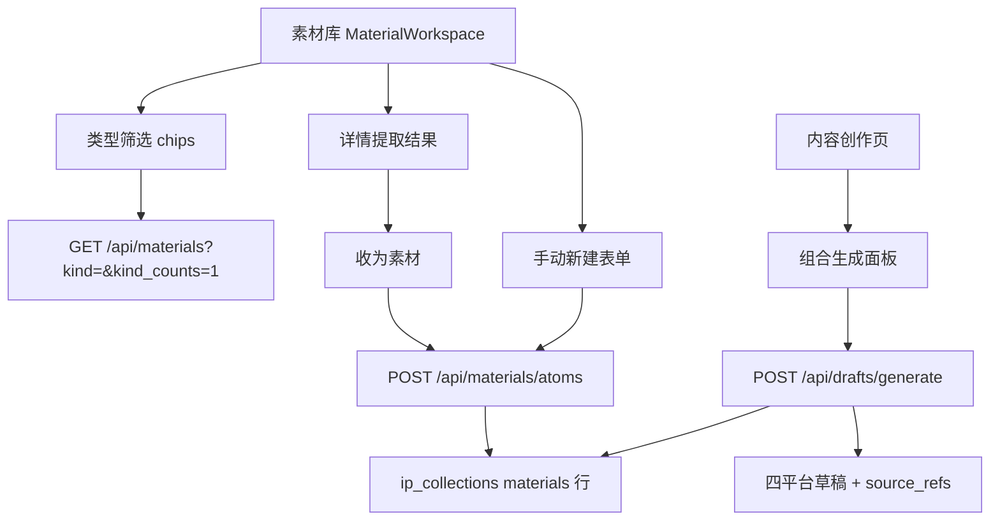

# 素材原子化与组合创作

Feature Name: material-atomization
Updated: 2026-08-30

## Description

为素材库引入五类素材类型（article/quote/hotspot/insight/experience），提供"从文章一键收录原子素材"与"手动新建原子素材"两条产出路径，并在内容创作页提供组合生成面板（选题 + 结构 + 金句 + 经历），一次生成四平台草稿，全部引用关系写入来源链路。

## Architecture



服务端沿用单文件路由（server/index.mjs）+ ip_collections 存储（mysql.mjs），新增 `/api/materials/atoms` 路由，扩展 materials GET 与 drafts/generate POST；前端在 MaterialWorkspace 与 WorkspaceView 内容创作分支扩展。

## Components and Interfaces

### server/index.mjs

1. **materials GET 扩展**
   - 新增 `kind` 参数：`items.filter(item => (item.material_kind || 'article') === kind)`，`kind` 参与已有 hasQuery 判断。
   - 新增 `kind_counts=1` 参数：返回 `{ kind_counts: { article, quote, hotspot, insight, experience } }`，与分页结果互斥。
2. **materials atoms POST（新路由）**
   - 请求体：`{ kind, text, name?, source_id? }`。
   - 校验：`kind` ∈ quote/hotspot/insight/experience；`text` 非空；`source_id` 存在时必须属于当前用户。
   - 重复收录判定：`source_id` 提供时，若已存在同 owner、同 `origin_source_id`、同 `origin_text` 的原子素材，返回 200 与 `{ duplicate: true, item: 既有素材 }`；否则 201 返回新素材。
   - 新素材字段：`material_kind: kind`、`name: name || text.slice(0, 40)`、`content: text`、`format: 'text'`、`status: 'ready'`、`review_status: 'pending'`、`origin_source_id: source_id || null`、`origin_text: text`、`source_refs: source_id ? [sourceRef('material', source_id)] : []`、`imported_at`。
   - 持久化 `saveState('materials')`。
3. **materials upload POST 扩展**
   - 接受可选 `material_kind`，合法值与 atoms 相同（默认 article），写入新素材。
4. **drafts/generate POST 扩展**
   - 新增接受 `quote_ids: number[]`、`experience_ids: number[]`，校验对应素材属于当前用户且 material_kind 匹配（quote_ids → quote，experience_ids → experience），非法 id 忽略。
   - 创作锚点校验：`topic`（含 title）与 `structure_id` 至少一项有效，否则 422 `{ error: '至少需要一个创作锚点' }`。
   - 正文组装顺序：`topic.title` → 结构 `steps.join(' → ')`（若有）→ 金句块（`金句参考：1. ... 2. ...`）→ 经历块（`我的经历素材：...`）→ 固定行动指引。
   - `source_refs` 合并：topic.source_refs + structure ref + 全部金句/经历素材 ref。
   - 持久化 `saveState('drafts')`。

### src/main.tsx

1. **MaterialWorkspace**
   - 类型状态 `kind: string`；筛选行新增"类型"filter-label + chips（全部/文章/金句/热点/知识点/经历），选中态沿用 chip.active。
   - 首次加载请求 `kind_counts=1` 缓存计数，chips 显示计数；收录/新建成功后刷新计数。
   - asset-row 列表：原子素材行显示类型 tag（金句/热点/知识点/经历）与来源文章名（origin_source_id 对应名称，客户端从全量列表映射，查不到时显示"手动创建"）。
   - 详情提取结果：每条 quote/candidate_topic 渲染"收为素材"按钮，调用 atoms POST；响应 duplicate 或成功后按 origin_text 匹配当前原子素材列表将按钮置为"已收录"。
   - 新增"手动新建"按钮展开行内小表单（类型 select + 文本 textarea + 提交），复用 structure-editor 视觉。
2. **WorkspaceView 内容创作分支**
   - 草稿网格上方渲染组合生成面板 `compose-panel`：选题标题输入、结构下拉（StructureItem 列表，拉 `/api/structures?page=1`）、金句 chips 多选（kind=quote 素材）、经历 chips 多选（kind=experience 素材）、生成按钮。
   - 提交 `POST /api/drafts/generate`，成功后刷新 drafts 列表。
   - 空态提示保持 structure-empty 样式。

### src/styles.css

- 新增：kind 筛选 chips 沿用 .chip；原子类型 tag（.kind-tag，复用 platform-tag 结构，五色区分）；.collected-mark（已收录禁用态）；.compose-panel（卡片布局：四行输入区 + 底部操作行）；.atom-mini-form（行内新建表单）。
- 四主题变量兼容：仅使用现有 --surface/--line/--accent 系变量。

## Data Models

```ts
type MaterialKind = 'article' | 'quote' | 'hotspot' | 'insight' | 'experience'
// MaterialItem 扩展字段（均可选，读取时缺省归 article）
{ material_kind?: MaterialKind, origin_source_id?: number | null, origin_text?: string }
```

存储于 ip_collections `materials` 行 JSON，无 schema 迁移；历史行读取时按 `material_kind || 'article'` 归一。

## Correctness Properties

1. 原子素材的 `source_refs` 与 `origin_source_id` 指向存在的素材记录，删除不做级联（源文章删除后原子保留，显示"来源已移除"）。
2. `kind` 筛选结果与 `kind_counts` 一致（对全量数据归一后统计）。
3. drafts/generate 生成的每份草稿 `source_refs` 覆盖本次全部被引用素材与结构。
4. 重复收录判定幂等：同 source_id + origin_text 的 atoms POST 多次调用只产生一条素材。

## Error Handling

- atoms POST：kind/text 非法 → 422；source_id 不存在或不属于用户 → 422 `{ error: '来源素材不存在' }`。
- drafts/generate：锚点缺失 → 422；quote_ids/experience_ids 含无效 id → 静默忽略（容错组装）。
- 前端：调用失败沿用 structure-error 提示条；收录成功就地按钮态变更，无弹窗。

## Test Strategy

- server/materials-atoms.test.mjs（或并入现有测试文件）：
  1. atoms 创建带 source_id → 201、字段完整、source_refs 指向源
  2. 重复收录同 source_id + text → duplicate: true 且不新增行
  3. 手动新建（无 source_id）→ source_refs 空
  4. kind 筛选与 kind_counts 正确、历史无 kind 数据归 article
  5. drafts/generate 组合生成：正文含结构与金句、source_refs 完整、锚点缺失 422
- server/web-assets.test.mjs：前端特征断言（收为素材按钮、类型 chips、组合面板、atoms 路由调用）。

## References

[^1]: server/index.mjs:415 - 现有素材导入提取逻辑
[^2]: server/index.mjs:720 - 现有 drafts/generate 逻辑
[^3]: src/main.tsx:839 - MaterialWorkspace 组件
[^4]: .monkeycode/specs/material-atomization/requirements.md - 需求文档
