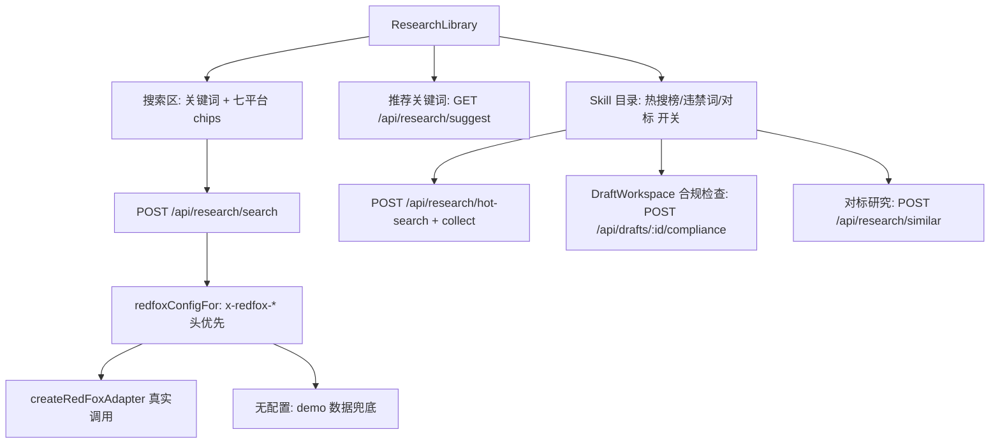

# 热点研究 × 红狐 Skill 融合 — 技术设计

Feature Name: redfox-research-skill-hub
Updated: 2026-08-30

## Description

热点研究升级为红狐驱动的研究工作区：关键词搜索（含系统推荐）、七平台筛选、红狐 Skill 目录与启用管理，本轮融合四个 Skill（热搜榜、关键词搜索、违禁词检测、相似账号对标）。全部 Skill 调用走"请求头配置优先 → 环境变量回退 → 演示数据兜底"三级策略，结果标注 `source: 'redfox' | 'demo'`。

## Architecture



## Components and Interfaces

### createRedFoxAdapter 扩展（server/redfox.mjs）

- 认证统一为 `x-api-key` 头（红狐 `ak_xxx` Key）
- 新方法（路径支持 adapter options 覆盖以适配红狐文档演进）：
  - `hotSearch({ platform })` → `GET {base}/v1/hot-search?platform=`，返回 `{ items: [{ rank, title, heat }] }`
  - `searchWork({ platform, keyword })` → `GET {base}/v1/search?platform=&keyword=`，返回 `normalizeResearchItem` 数组
  - `prohibitedCheck({ text })` → `POST {base}/v1/prohibited-check`，返回 `{ hits: [{ word, level, suggestion }] }`
  - `similarAccounts({ platform, account })` → `GET {base}/v1/similar-accounts?platform=&account=`，返回 `{ items: [{ nickname, followers, pillar, similarity, reason }] }`
- 无 `baseUrl || apiKey` 时抛 `error.code = 'MISSING_CONFIG'`，由路由层决定演示兜底
- 导出 `demoHotSearch(platform)`、`demoSearchWork(keyword, platform)`、`demoProhibitedCheck(text)`、`demoSimilarAccounts(platform, account)`：demoProhibitedCheck 用内置极限词表本地扫描（"第一/最好/国家级/绝对/100%/根治"等），带替换建议

### 服务端路由（server/index.mjs）

- `redfoxConfigFor(request)`：读 `x-redfox-base-url` / `x-redfox-api-key`，回退 `REDFOX_API_URL` / `PROJECT_REDFOX_API_KEY`
- `POST /api/research/search { keyword, platform }`：adapter.searchWork，MISSING_CONFIG → demo；结果经 normalizeResearchItem + `query: keyword` + source_refs 入研究库并返回
- `GET /api/research/suggest`：定位 pillars + 素材 `candidate_topics` 词频 + 研究标题分词频次 → 前 8 个；空来源回退通用词
- `POST /api/research/hot-search { platform }`：热搜榜（不入库）
- `POST /api/research/hot-search/collect { entries }`：选中热搜条目入库研究
- `POST /api/drafts/:id/compliance`：草稿 body 违禁词检测（422 校验草稿存在）
- `POST /api/research/similar { platform, account }`：对标账号列表
- 现有 `/api/research/refresh` 维持不变（trending）

### 前端（src/main.tsx）

- `redfoxHeaders()`：复用 loadApiSettings 构造透传头（抽取自 refreshResearch）
- ResearchLibrary 改造：
  - 搜索区：关键词输入 + 平台 chips（全平台/小红书/抖音/视频号/公众号/B站/微博/X）+ 搜索按钮 + 推荐关键词 chips（点击即搜）
  - Skill 目录区：四张 Skill 卡（热搜榜/关键词搜索/违禁词检测/相似账号），名称 + 说明 + 融合位置 + 启用开关；状态存 localStorage `dingweipai:skill-toggles`
  - 热搜榜面板：排名/标题/热度/入库按钮
  - 对标研究面板：账号输入 + 结果卡（昵称/粉丝/相似度/推荐理由）
  - 搜索与 Skill 调用带 `source` 标签展示（redfox/演示）
- DraftWorkspace：启用违禁词检测后草稿卡加"合规检查"按钮，结果展示命中词与建议
- 关键词搜索为默认能力（红狐核心），其余三个 Skill 可开关

## Data Models

```ts
type SkillToggles = { hotSearch: boolean; compliance: boolean; similarAccounts: boolean }
// localStorage key: 'dingweipai:skill-toggles'
type HotSearchEntry = { rank: number; title: string; heat: number; platform: string }
type ComplianceHit = { word: string; level: string; suggestion: string }
type SimilarAccount = { nickname: string; followers: string; pillar: string; similarity: number; reason: string }
```

## Correctness Properties

1. 服务端任何 Skill 调用在无红狐配置时返回演示数据且 `source: 'demo'`，不抛 5xx。
2. 请求头携带配置时，服务端调用的认证头与请求头值一致（x-api-key）。
3. 搜索/入库产生的每条研究记录都带 `query` 与 `source_refs`，可在结果中追溯来源。
4. Skill 开关状态只影响前端入口暴露，服务端路由始终可用（幂等）。

## Error Handling

| 场景 | 处理 |
|------|------|
| 红狐 429 | 返回现有 QUOTA_EXCEEDED 语义（429 + retryable） |
| 红狐 5xx/网络失败 | 502 + retryable，前端展示失败原因并保留现有数据 |
| demo 词表检测 | 纯本地，永不失败 |
| suggest 无来源 | 回退通用关键词 |

## Test Strategy

- `server/redfox-skills.test.mjs`（mock http server）：
  1. 无配置 search → demo 数据 + source: demo + 入库
  2. 带头配置 search → mock 收到 x-api-key + source: redfox
  3. suggest 含定位 pillar 词
  4. hot-search demo + collect 入库
  5. compliance 命中极限词并给建议
  6. similar demo 返回对标账号
- `server/web-assets.test.mjs`：Skill 目录、平台 chips、合规检查入口断言
- 回归：`npm run verify` 全绿
