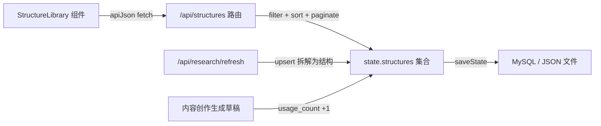

# 爆款结构库可检索化 — 技术设计

Feature Name: structure-library-retrieval
Updated: 2026-08-30

## Description

将爆款结构库从"research 数据的投影 + 硬编码卡片"升级为一等内容资产库：新增 `structures` 存储集合与 CRUD/检索 API，前端提供关键词搜索、平台/类型/收藏筛选、三种排序、卡片/列表双视图（按数量自动切换）、分页加载、详情展开、手动增删改与收藏。检索模式验证后可复制到素材库与热点研究。

## Architecture



沿用现有服务端模式：内存 `state` 集合 + `saveState()` 落盘（server/index.mjs:76），MySQL 与 JSON 文件双模式由启动参数决定。前端沿用 `apiJson` 封装与 `workspace-view` 容器样式。

## Components and Interfaces

### 后端路由（server/index.mjs）

| 方法 | 路径 | 行为 |
|------|------|------|
| GET | `/api/structures?q&platform&content_type&favorite&sort&page` | 按 owner 过滤，q 匹配标题与步骤，sort 取 `latest/usage/favorite`，分页返回 `{ items, total, page, page_size }` |
| POST | `/api/structures` | 手动新增，标题与步骤必填校验（复用 server/validation.mjs 模式） |
| PUT | `/api/structures/:id` | 编辑字段、切换收藏；`{ record_usage: true }` 时使用计数 +1 |
| DELETE | `/api/structures/:id` | 删除条目，返回 204；对已删除 id 幂等返回 204 |

研究自动沉淀：`/api/research/refresh` 生成拆解时，将每条 `analysis.structure` upsert 为结构条目（`source_kind: 'research'`, `source_id`），标题重复时更新步骤内容。

### 前端组件（src/main.tsx）

`StructureLibrary` 组件替换 main.tsx:254 的 `structure-grid` 分支，状态包括：

- `query`（搜索词）、`platformFilter`、`typeFilter`、`favOnly`、`sort`、`page`
- `view`：`'auto' | 'card' | 'list'`，total > 12 且 view 为 auto 时渲染列表视图
- `expandedId`：详情展开；`editor`：新增/编辑表单状态

交互元素：

- 顶部工具行：搜索框、筛选 chips（平台、内容类型、收藏）、排序下拉、视图切换、添加结构按钮
- 列表视图：紧凑行（标题、类型标签、平台、使用次数、收藏星标），点击展开详情
- 卡片视图：沿用 `trend-card`，仅展示前两页数据
- 详情展开：完整步骤编号列表、来源引用、匹配理由、`用这个结构`按钮（调用 drafts/generate 前先 `record_usage`）
- 分页：`加载更多`按钮，page_size 50

## Data Models

```typescript
type Structure = {
  id: number
  owner_id: string
  title: string
  steps: string[]
  platform: string          // 小红书 / 抖音 / 视频号 / 公众号 / 通用
  content_type: string      // 观点 / 案例 / 清单 / 故事 / 对比 / 教程
  source_kind: 'research' | 'manual'
  source_id?: number
  source_refs: unknown[]
  favorite: boolean
  usage_count: number
  created_at: string
  updated_at: string
}
```

存储接入：`defaultState.structures: []`（server/index.mjs:53 区域），合并 `persistedState.structures || []`，owner 归属循环（server/index.mjs:68）加入 `structures`。MySQL 模式经 `saveMysqlState` 整体序列化，无需单独建表。

## Correctness Properties

1. 检索结果集合与搜索词、筛选条件、排序参数完全一致。
2. 空标题或空步骤的结构保存请求返回 400。
3. 删除后的结构条目在 GET 结果中隐藏。
4. 收藏状态在 saveState 后跨会话保持。
5. 使用计数单调递增。
6. 研究刷新对同一 research 来源的 upsert 幂等（同标题更新步骤、不新增重复条目）。

## Error Handling

- GET/PUT/DELETE 失败：前端保留上一次成功结果并显示行内错误提示，输入内容不丢失。
- 401：沿用 `apiJson` 现有会话处理。
- 删除不存在的 id：返回 204 幂等。
- 研究刷新沉淀失败：刷新主流程继续，结构沉淀错误记录响应日志，不阻塞研究返回。

## Test Strategy

- 服务端新增 `server/structures.test.mjs`（node --test）：CRUD 全路径、检索过滤组合、排序、分页、使用计数、幂等删除、upsert 去重、空标题 400。
- 前端：`npm run typecheck` + `npm run build`；检索交互以本地 dev 服务器人工验收。
- 回归：`npm run verify`（test + typecheck + build）通过后部署。

## References

- server/index.mjs:53 — state 集合定义与持久化合并
- server/index.mjs:76 — saveState 落盘模式
- server/index.mjs:403 — /api/research 路由与 owned 过滤模式
- src/main.tsx:254 — 现有 structure-grid 渲染分支（本次替换点）
- .monkeycode/specs/structure-library-retrieval/requirements.md — 本功能需求文档

## 模式复制记录（2026-08-30）

同一检索模式已复制到素材库与热点研究：

- `GET /api/materials?q&format&status&review_status&sort&page`：q 匹配名称+正文；sort 取 `latest/name`。`GET /api/research?q&platform&sort&page`：q 匹配标题+作者；sort 取 `latest/discussions/growth`。
- API 兼容约定：两个端点无检索参数时保持返回数组（桌面同步客户端与既有测试依赖）；携带任一检索参数时返回 `{ items, total, page, page_size }`。
- 前端 `MaterialWorkspace` 重写为自取数检索组件（格式/解析状态/核验状态 chips + 正文搜索 + 行展开提取结果）；新增 `ResearchLibrary` 组件承载热点研究（平台 chips + 排序 + 刷新 + 展开拆解）。
- 选题助手生成来源改为生成时即时拉取 `/api/research` 与 `/api/materials`，WorkspaceView 移除常驻 research/materials 状态。
- 新增 `server/library-search.test.mjs` 覆盖两端点兼容行为与过滤排序。
