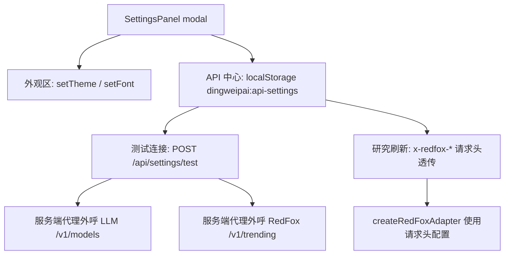

# 工作台设置与 API 中心 — 技术设计

Feature Name: workbench-settings-api-hub
Updated: 2026-08-30

## Description

新增统一的"工作台设置"覆盖层面板，含外观设置（主题/字体）与 API 中心（大模型 API、红狐 API 的配置管理与连通性测试）。API 配置仅存浏览器 localStorage，随请求头透传服务端使用；红狐配置立即接入热点研究刷新（请求头优先，回退环境变量）。大模型 API 本轮完成配置管理与连通测试，生成链路接入放后续迭代。

## Architecture



- 前端单文件 `src/main.tsx`：新增 `SettingsPanel` 组件与 `loadApiSettings/saveApiSettings` 工具；`apiJson` 合并 headers（现有实现 options.headers 会整体覆盖默认头，需改为合并）。
- 服务端 `server/index.mjs`：新增 `POST /api/settings/test`；`/api/research/refresh` 读取 `x-redfox-base-url` / `x-redfox-api-key` 请求头，未携带时回退 `REDFOX_API_URL` / `PROJECT_REDFOX_API_KEY`。

## Components and Interfaces

### SettingsPanel（前端）

- Props: `theme, setTheme, font, setFont, onClose`
- 覆盖层交互：点击遮罩、关闭按钮、Esc 键均可关闭
- 外观区：主题三选（编辑纸感/清泉青/子夜蓝）与字体三选（衬线/无衬线/手写楷），点击立即生效并高亮当前项
- API 中心区：大模型 API（Base URL / API Key / 模型名）与红狐 API（Base URL / API Key）两张表单卡，各含"保存配置"与"测试连接"

### apiSettings 工具（前端）

- `loadApiSettings(): ApiSettings`、`saveApiSettings(settings): void`
- 存储 key `dingweipai:api-settings`，结构 `{ llm: { base_url, api_key, model }, redfox: { base_url, api_key } }`

### POST /api/settings/test（服务端）

- 请求体 `{ type: 'llm'|'redfox', base_url, api_key, model? }`
- 校验：type 必须为枚举值；base_url 必须可通过 `new URL()` 构造且协议为 http/https（非法返回 422）
- llm：`GET {base_url}/models`，Header `Authorization: Bearer {api_key}`，8s 超时；响应 2xx → `{ ok: true }`，否则 `{ ok: false, status, error }`
- redfox：`GET {base_url}/v1/trending?platform=小红书&query=连通测试&days=1`，Header `Authorization: Bearer {api_key}`，8s 超时，判定同上
- 连接异常返回 `{ ok: false, error }`，HTTP 200（业务结果在 body），不回显请求体

### 研究刷新透传（服务端）

- `/api/research/refresh` 构造 adapter 时：`baseUrl = trim(request.headers['x-redfox-base-url']) || process.env.REDFOX_API_URL`，`apiKey = trim(request.headers['x-redfox-api-key']) || process.env.PROJECT_REDFOX_API_KEY`
- 请求头值不写入结构化日志（现有日志仅记录 method/path/status）

## Data Models

```ts
type ApiSettings = {
  llm: { base_url: string; api_key: string; model: string }
  redfox: { base_url: string; api_key: string }
}
```

localStorage key：`dingweipai:api-settings`（JSON，读写均容错：解析失败返回空配置）

## Correctness Properties

1. API Key 的唯一持久化位置是浏览器 localStorage；服务端数据库、日志、备份不包含 Key。
2. 设置面板的任何关闭路径（遮罩/Esc/按钮）后，工作区状态与既有主题/字体保持不变。
3. `x-redfox-*` 请求头存在时，研究刷新使用的红狐配置与请求头完全一致。
4. `/api/settings/test` 对任意输入都在 8s 内返回，且响应体不包含请求体原文。

## Error Handling

| 场景 | 处理 |
|------|------|
| 测试目标不可达/超时 | `{ ok: false, error: '服务连接失败或超时' }` |
| 测试目标返回非 2xx | `{ ok: false, status, error }` |
| base_url 非法 | HTTP 422 `{ error }` |
| localStorage 读写异常 | 忽略错误，UI 回退到空配置 |
| 红狐刷新失败 | 维持现有 429/502 与 retryable 语义 |

## Test Strategy

- `server/settings.test.mjs`：
  1. 参数校验（缺 type / 非法 base_url → 422）
  2. llm 测试：本地 mock http server 返回 200/401，分别断言 `ok: true` 与 `ok: false` 带 status
  3. redfox 测试：mock `/v1/trending` 200 → `ok: true`
  4. 研究刷新：mock 红狐服务 + 请求头携带配置 → mock 收到的 Authorization 与 header 一致；无请求头 → 使用环境变量
- `server/web-assets.test.mjs`：设置按钮绑定 `showSettings`；`SettingsPanel` 引用 API 中心与 localStorage key；`apiJson` headers 合并逻辑存在
- 回归：`npm run verify` 全绿（typecheck + build + 全部 node --test）

## References

- 现有 RedFox adapter：`server/redfox.mjs`（createRedFoxAdapter，Bearer 认证）
- 研究刷新现状：`server/index.mjs` /api/research/refresh（环境变量配置）
- 主题/字体机制：`src/main.tsx` ThemeMenu、`src/styles.css` `.theme-*` / `.font-*`
- 修复点：`src/main.tsx` 侧栏"工作台设置"按钮当前误绑 `setShowReview(true)`
